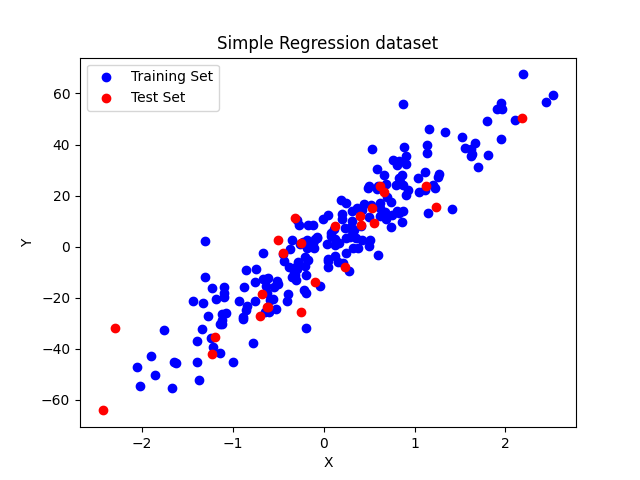
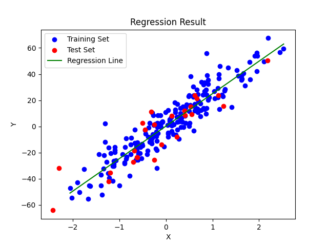
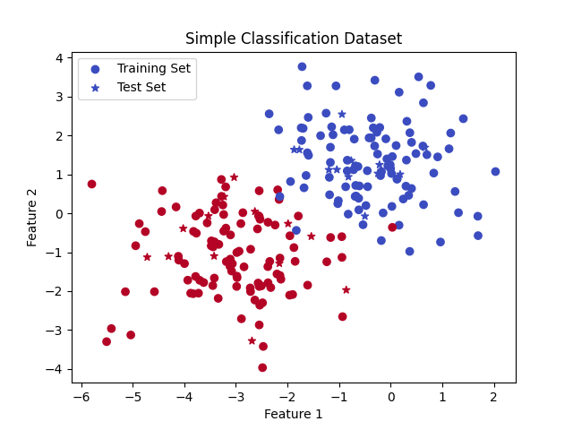
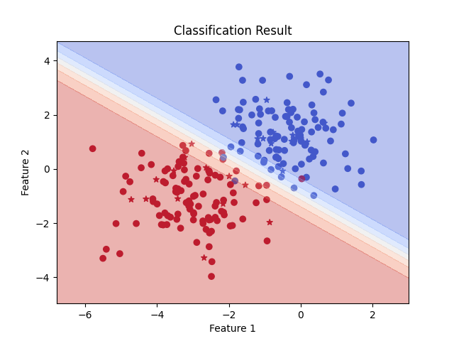
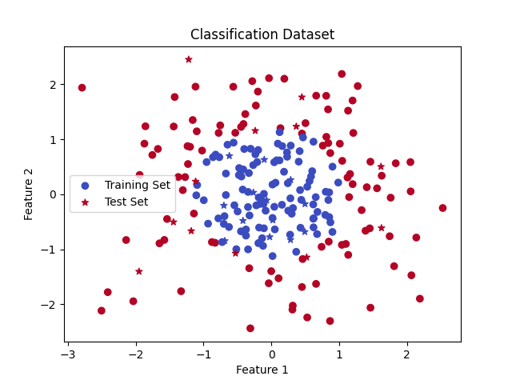
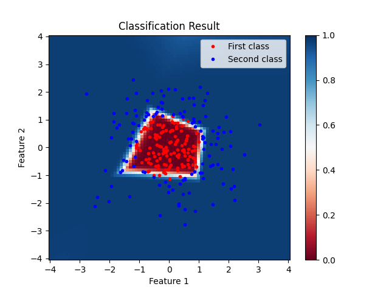

# Building Neural Networks from Scratch

Within the context of a school course, We developed practical implementations of fundamental neural network components using Python and NumPy. Our scope encompasses crafting the Monoperceptron, Multilayer Perceptron (MLP), and Backpropagation algorithm.

These implementations were an integral part of our course curriculum, providing hands-on experience with neural networks from the ground up.

## Monoperceptron
Here are some results from our Monoperceptron implementation:

### **Linear regression:**

### **Binary classification:**

When employing a single-layer perceptron with a linear activation function for binary classification, a linear decision boundary is inevitable. This is due to the nature of the computation: \(ŷ = W.x + b\). Consequently, the decision boundary is determined by a linear combination of the input features. In two dimensions, it results in a straight line, in three dimensions, a flat plane, and so forth for higher dimensions. This linear nature restricts the model to separating classes that are linearly separable.
## Multi-Layer Perceptron
Here are some results from our Multi-Layer Perceptron implementation:

### **Binary classification:**

In this case the classes do not have a linear separation, a single-layer perceptron proves inadequate for accurate classification. In contrast, employing a Multi-Layer Perceptron results in a decision boundary that isn't a simple straight line, but rather a complex surface defined by multiple curves. This decision boundary is determined by a non-linear combination of the input features, enabling the model to effectively separate classes that lack linear separability.