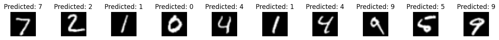
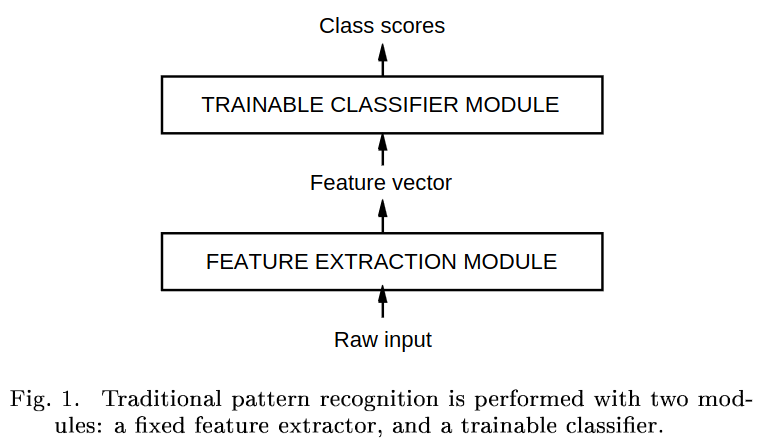

# LeNet-5 Architecture

The LeNet-5 architecture, introduced in the research paper **"Gradient-Based Learning Applied to Document Recognition" by Lecun et al.**, signifies a pivotal advancement in pattern recognition. It replaces the traditional approach of hand-crafted feature extractors with convolutional neural networks (CNNs) that autonomously learn and identify patterns.

In this project, I implement LeNet-5 from scratch and train it on the MNIST dataset for handwritten digit recognition.
The achieved accuracy on the test set stands at an impressive 98.42%.
Here are some results of the LeNet-5 architecture on the MNIST dataset for handwritten digit recognition:

# **Traditional Approach**
In the past, pattern recognition systems were composed of modules: the feature extractor and the classifier. The feature extractor transformed input patterns into low-dimensional vectors, which had to be meticulously designed for each task. This approach was effective but required substantial manual effort.

The main challenge with the traditional approach was the dependence on hand-crafted features. Recognition accuracy relied heavily on the designer's ability to engineer suitable features, a daunting task that had to be repeated for every new problem.

# **The Solution**
The **LeNet-5** architecture in this paper overcomes this challenge by introducing convolutional neural networks that automatically learn features through local connections and shared weights, making it robust to shifts, scales, and distortions.

# **Key Advantages**
- CNNs exploit the inherent 2D local structure in images, capturing spatial correlations and enabling feature extraction.
- The LeNet-5 architecture, with local receptive fields and sub-sampling, ensures shift, scale, and distortion invariance.
- This approach significantly reduces the need for hand-crafted features, enhancing adaptability to various recognition tasks.

# **My Main Takeaways**
* Better pattern recognition systems can be built by relying more on automatic learning, and less on had-designed heuristics.
* No learning technique can succeed without a minimal amount of prior knowledge about the task. In the case of multi-layer neural Networks, a good way to incorporate this knowledge is to tailor its architecture to the task. CNNs incorporate knowledge about the invariances of 2D shapes by using local connection patterns, and by imposing constraints on the weights.
* The performance of the system on a training set is of little interest. What we really care about is its performance on a test set. The goal of learning is to produce a system that performs well on new unseen examples, not just on the examples used to train it.
* The difference between training and testing errors is influenced by both the complexity of the network and the size of the training dataset. When the network is highly complex, it has a greater tendency to overfit the training data, resulting in a larger gap $E_{train} - E_{test}$. Conversely, with a larger training set, there's a higher probability that it adequately represents the test set, leading to a smaller gap $E_{train} - E_{test}$.
* CNNs ensure shift, scale, and distortion invariance.