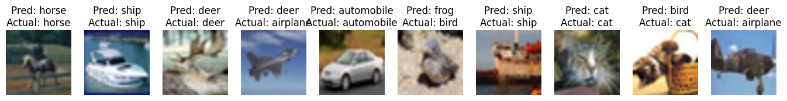

# AlexNet

AlexNet is a groundbreaking deep convolutional neural network architecture that revolutionized image classification tasks. Developed by Alex Krizhevsky, Ilya Sutskever, and Geoffrey Hinton, this architecture achieved remarkable results in the ImageNet Large Scale Visual Recognition Challenge (ILSVRC) in 2012, significantly outperforming traditional computer vision approaches.

In this article, I will implement the AlexNet architecture from scratch and train it on a subset of the cifar-10 dataset.
The achieved accuracy on the test set stands at an impressive is 76% on the test set.
Here are some results of the AlexNet architecture on the test set:

# Traditional Approach

Before the advent of deep learning and AlexNet, traditional image classification relied on handcrafted features and shallow models. Feature engineering was a time-consuming process, and these methods struggled to handle the complexity and variability of real-world image data.

# The Challenge

The ImageNet Challenge, which aimed to classify images into one of 1,000 object categories, posed a significant challenge due to the large dataset size and the diversity of images. Traditional methods struggled to achieve high accuracy on this complex task.

# The Solution

AlexNet introduced several key innovations that contributed to its success:

- **Deep Convolutional Layers**: The architecture consists of eight layers, with five convolutional layers followed by three fully connected layers. This deep architecture allowed the model to learn hierarchical features from raw pixel values.

- **Rectified Linear Units (ReLU)**: AlexNet adopted the ReLU activation function, addressing the vanishing gradient problem. Unlike sigmoid or tanh, ReLU maintains a constant gradient of 1 for positive values, preventing gradient vanishing.

- **Local Response Normalization (LRN)**: While LRN has been largely replaced in modern architectures, it was used in AlexNet to normalize the responses of neurons in the first two convolutional layers.

- **Overlapping Max Pooling**: Max-pooling layers with a kernel size of 3 and a stride of 2 were employed to reduce spatial dimensions while retaining important features.

- **Dropout**: To prevent overfitting, dropout layers were introduced in the fully connected layers during training. However, it's worth noting that later architectures reduced the use of dropout.

- **Data Augmentation**: AlexNet used data augmentation techniques like random cropping and horizontal flipping during training to increase the effective size of the training dataset.

AlexNet's key advantages include its depth, use of ReLU activation functions, and innovative architectural design. These factors allowed it to achieve a top-5 error rate of just 15.3% in the ILSVRC 2012 competition, a significant improvement over previous methods.