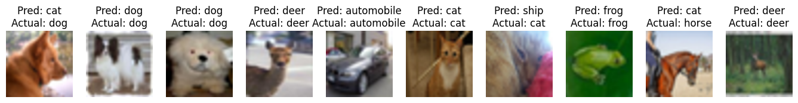

## Vgg Network

VggNet, introduced by the paper **Very Deep Convolutional Networks for Large-Scale Image Recognition** played a pivotal role in revolutionizing image recognition. Its deep architecture, innovative use of small convolutional filters, and parameter efficiency set new standards for accuracy in large-scale image classification tasks. The success of VggNet paved the way for the development of even deeper neural networks, further advancing the field of computer vision and deep learning.

In this project, I implement the Vgg16 Network from scratch and train it on a subset of the cifar-10 dataset.
The achieved accuracy on the test set stands at 71%, which is impressive giving the fact that I used a small dataset, and did not use data augmentation techniques.

Here are some results of the Vgg Network on the test set:

### The Challenge

One of the significant challenges in image recognition was to develop deep learning architectures that could automatically learn intricate features from raw image data. The challenge was to create models that could handle the vast amount of image data, exploit hierarchical feature representations, and scale efficiently.

### The Solution

The solution to these challenges came in the form the VggNet architecture. VggNet, short for **Very Deep Convolutional Networks** introduced a breakthrough in image classification. It featured an exceptionally deep architecture with small 3x3 convolutional filters, replacing traditional large receptive fields.

### Key Advantages

VggNet's key advantages included:

- **Deep Architectural Innovation**: VggNet's deep architecture, composed of multiple 3x3 convolutional layers, allowed it to capture intricate features and hierarchies in images effectively.

- **Improved Training**: The deep network's structure benefited from more non-linear rectification layers, enhancing its discriminative power during training.

- **Parameter Efficiency**: Despite its depth, VggNet reduced the number of parameters compared to alternative architectures with large convolutional filters, providing computational efficiency.