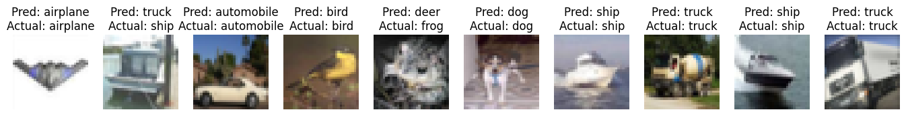

# ResNet Network

ResNet, short for **Residual Network**, is a groundbreaking architecture that addressed the vanishing gradient problem in deep neural networks. This innovation introduced residual blocks, allowing for the training of extremely deep networks. ResNet's impact on image recognition and various other tasks is undeniable, setting new benchmarks for accuracy and depth in deep learning.

In this project, I implemented the ResNet architecture and trained it on a subset of the CIFAR-10 dataset. The model achieved an outstanding accuracy of 80% on the test set, showcasing the effectiveness of residual connections in training very deep networks.

Here are some visualizations of the ResNet Network's performance on the test set:

### The Challenge

The primary challenge in training deep neural networks was the vanishing gradient problem, where gradients became too small during backpropagation, making it difficult for the network to learn. This limited the depth of networks that could be effectively trained.

### The Solution

The solution was presented in the form of ResNet. By introducing residual connections, ResNet allowed for the training of networks with hundreds of layers. The residual blocks enabled the network to learn the difference between the current layer's representation and the original input, mitigating the vanishing gradient problem.

### Key Advantages

ResNet brought several crucial advantages to the field:

- **Addressing the Vanishing Gradient**: The introduction of residual connections allowed for the training of exceptionally deep networks, revolutionizing the field of deep learning.

- **Increased Depth without Performance Degradation**: ResNet demonstrated that deeper networks could be more easily trained, leading to higher accuracy and better generalization.

- **State-of-the-Art Accuracy**: ResNet consistently achieved top performance on various image recognition tasks, becoming a standard architecture for many applications.

- **Adaptability**: The concept of residual connections was not limited to image recognition, and ResNet's principles have been applied to various domains with great success.