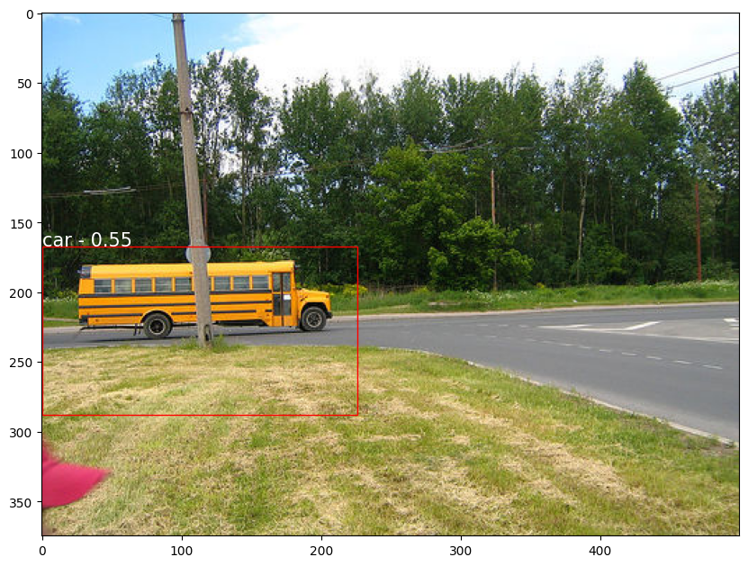
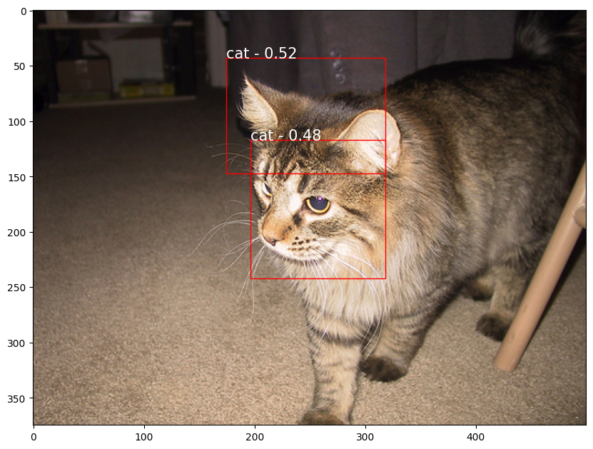
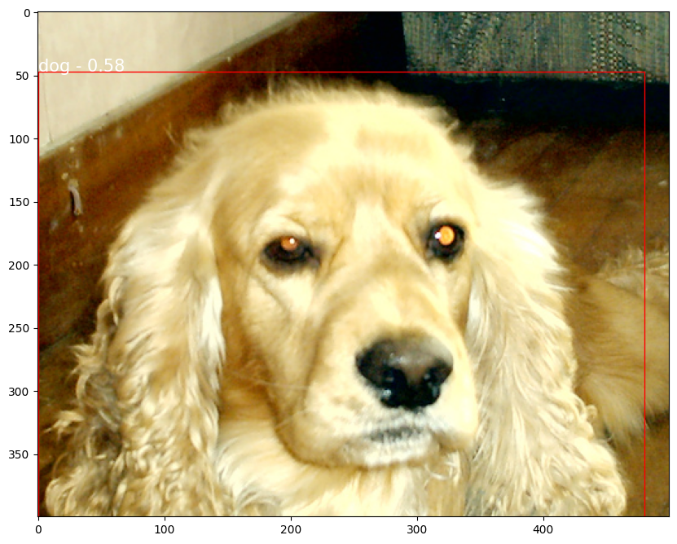

## RCNN for Object Detection

Region-based Convolutional Neural Networks (RCNN) was a seminal work in the field of object detection. It introduced a novel approach by combining region proposals with a deep neural network to identify objects in images. This methodology marked a significant advancement in object detection and laid the foundation for subsequent developments in this area.

In this project, I implemented the basic RCNN architecture and trained it on a custom dataset for object detection.

Here are some visualizations of the RCNN's performance on the test set:

### The Challenge

Object detection involves not only recognizing objects in an image but also precisely localizing them. This requires an algorithm that can efficiently propose regions of interest and accurately classify them.

### The Solution

RCNN addressed this challenge by introducing a two-step approach. It first generated region proposals using an external algorithm (e.g., selective search) and then used a deep neural network to classify and refine these proposals. This allowed for accurate object localization and classification.

### Key Advantages

RCNN brought several crucial advantages to object detection:

- **Accurate Localization**: By using region proposals, RCNN excelled in precisely localizing objects within an image.

- **Flexibility in Region Proposals**: The use of external algorithms for region proposal generation allowed for flexibility and adaptability to different types of objects and scenes.

- **State-of-the-Art Performance**: RCNN achieved top performance in object detection tasks on various datasets, demonstrating its effectiveness and versatility.

- **Framework for Future Architectures**: The RCNN framework laid the groundwork for subsequent developments in object detection, serving as a basis for more advanced architectures like Fast R-CNN and Faster R-CNN.