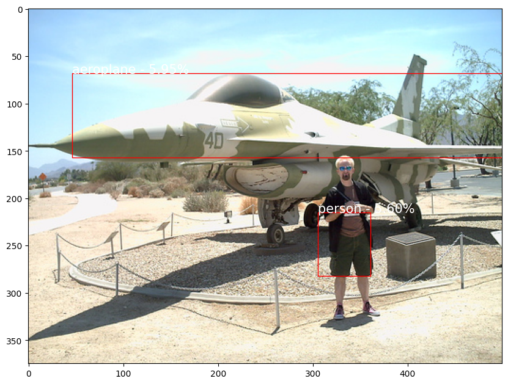
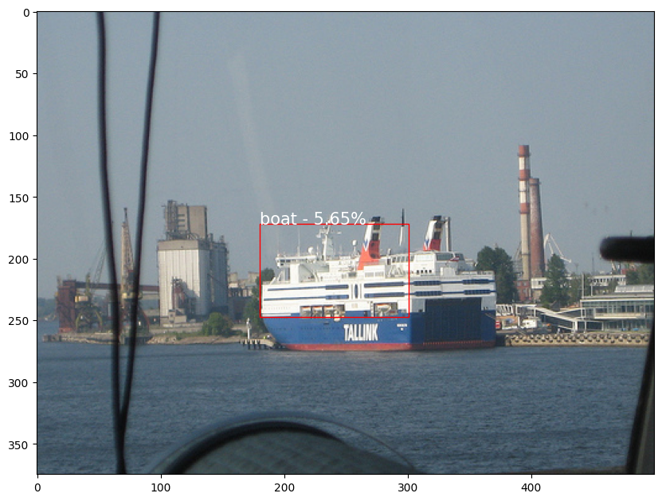
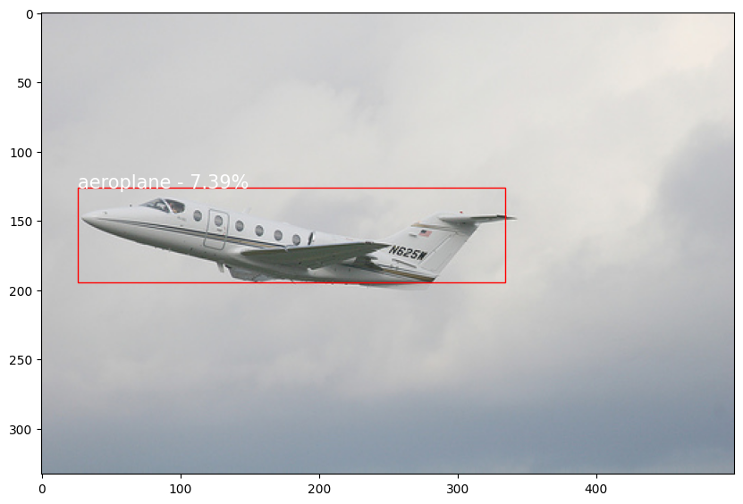
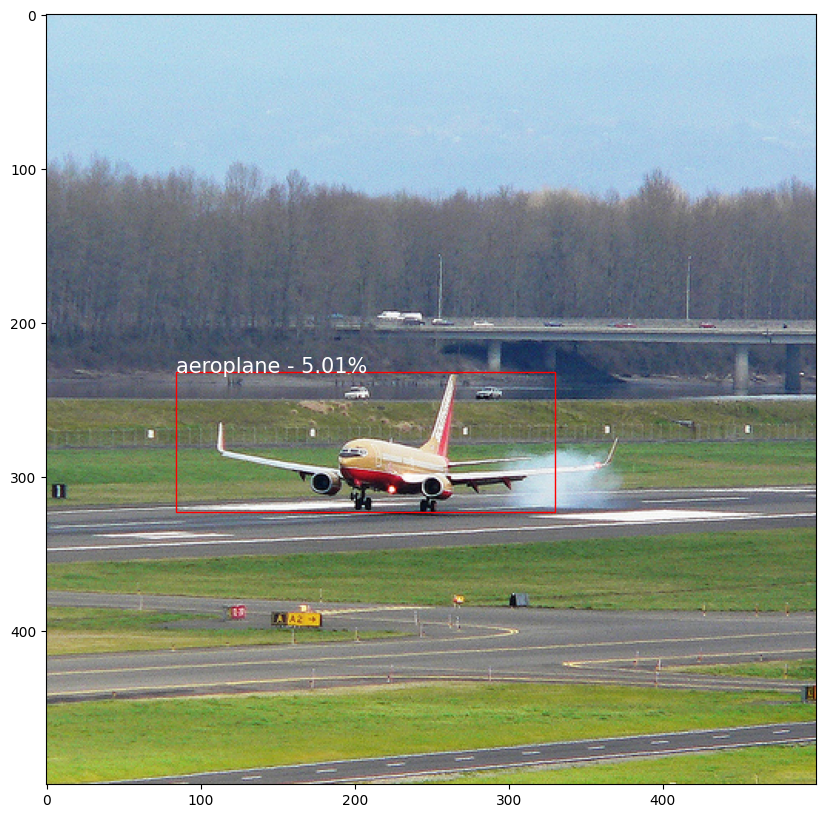
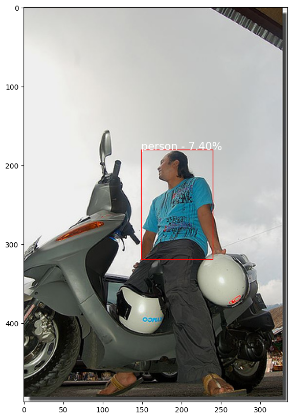

## Fast R-CNN for Object Detection

Fast R-CNN, an evolution of the original RCNN, introduced a streamlined and more efficient approach to object detection. It addressed some of the computational bottlenecks of RCNN, making it faster and more practical for real-world applications. Fast R-CNN integrated region proposal generation and feature extraction into a single network, significantly improving both speed and accuracy in object detection tasks.

In this project, I implemented the Fast R-CNN architecture and trained it on a custom dataset for object detection.

Here are some visualizations of the Fast R-CNN's performance on the test set:

### The Challenge

While RCNN introduced a novel approach to object detection, it suffered from computational inefficiencies due to its multi-stage architecture. The process of generating region proposals and then classifying them separately was time-consuming.

### The Solution

Fast R-CNN addressed this challenge by integrating region proposal generation and feature extraction into a single network. This eliminated the need for multiple forward passes through the CNN, making the process much faster and more efficient.

### Key Advantages

Fast R-CNN brought several crucial advantages to object detection:

- **Improved Efficiency**: By combining region proposal generation and feature extraction, Fast R-CNN significantly reduced computational complexity, making it more suitable for real-time applications.

- **Single Pass Processing**: The integration of tasks into a single pass through the network streamlined the entire process, leading to faster inference times.

- **State-of-the-Art Accuracy and Speed**: Fast R-CNN achieved a balance between speed and accuracy, outperforming its predecessor while still providing accurate object detection results.

- **Foundation for Further Advancements**: Fast R-CNN set the stage for subsequent developments in object detection, serving as a basis for architectures like Faster R-CNN.