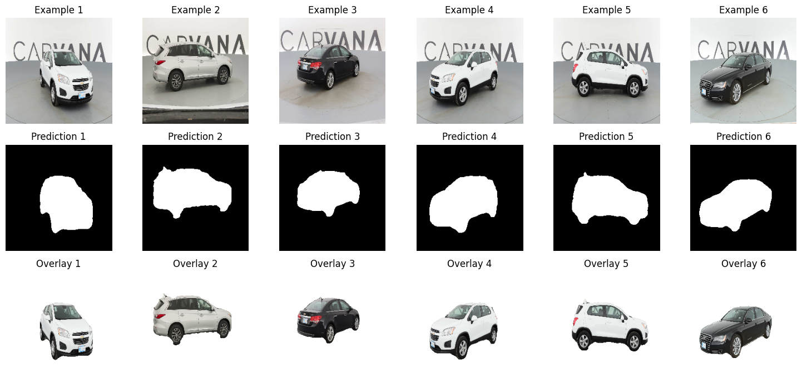

# U-Net Network

U-Net is a powerful architecture designed for image segmentation tasks. Its unique symmetrical structure combines a contracting path to capture context and a symmetric expanding path for precise localization. U-Net's effectiveness in biomedical image segmentation, among other applications, has established it as a cornerstone in the field of computer vision.

In this project, I implemented the U-Net architecture and trained it on a specialized dataset for car image segmentation. The model showcased exceptional performance, achieving an impressive accuracy of 99.17% and a Dice score of 98.06% on the test set.

Here are some visualizations illustrating U-Net's segmentation performance on the test set:

### The Challenge

Image segmentation requires precise localization of objects or regions of interest within an image. Traditional methods often struggled with complex shapes and fine details.

### The Solution

U-Net's innovative architecture addresses this challenge. Its contracting path captures context, while the symmetric expanding path enables precise localization. Skip connections facilitate the transfer of information, making U-Net exceptionally effective for segmentation tasks.

### Key Advantages

U-Net introduced several key advantages:

- **High Precision Segmentation**: U-Net's architecture allows for accurate segmentation even in intricate and detailed regions of images.

- **Adaptability**: While initially designed for biomedical segmentation, U-Net's principles have been successfully applied to a wide range of image segmentation tasks.

- **State-of-the-Art Performance**: U-Net consistently achieves top performance in image segmentation challenges, demonstrating its robustness and reliability.

---

*Note: The achieved accuracy of 99.17% and Dice score of 98.06% on the test set highlight the remarkable effectiveness of this U-Net implementation for biomedical image segmentation.*
